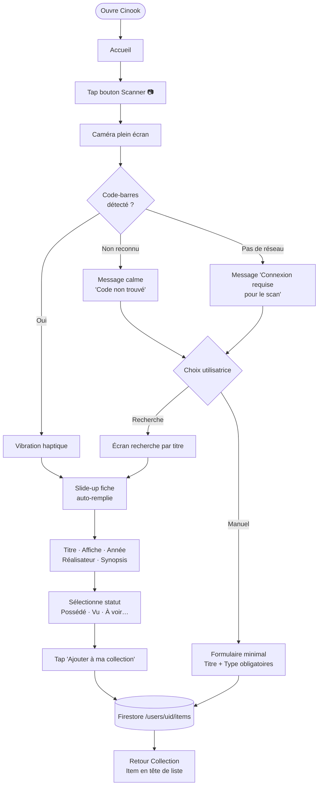
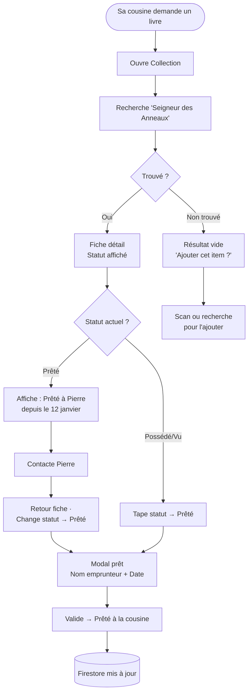
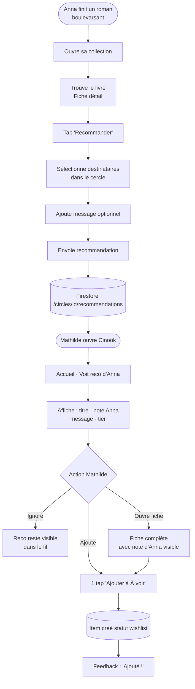
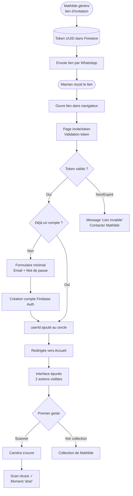
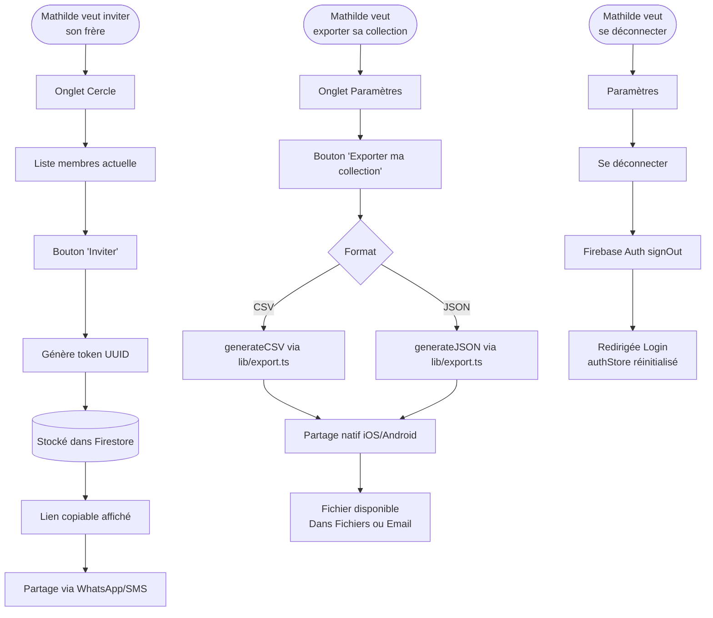
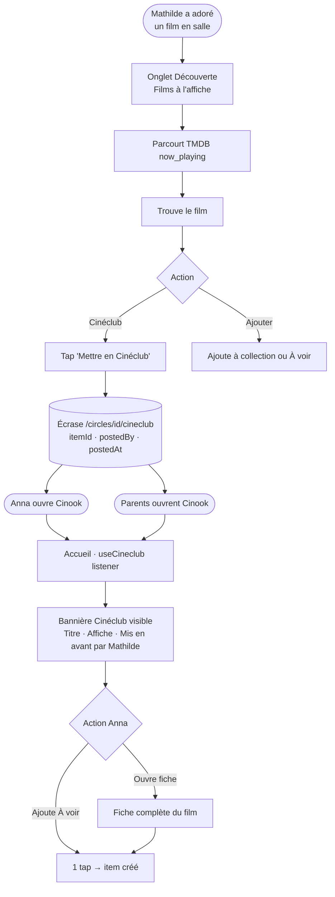

# UX Design Specification Cinook

**Author:** Mathilde
**Date:** 2026-03-06

---

## Executive Summary

### Project Vision

Cinook est une médiathèque personnelle souveraine et intime — l'antithèse des plateformes sociales publiques. Née de la frustration de Mathilde après la perte de données sur une app tierce, elle réunit en un seul endroit Films, Séries et Livres physiques, avec un niveau de friction proche de zéro grâce au scan de codes-barres. Partagée exclusivement entre proches par invitation, Cinook offre la chaleur d'un espace culturel commun sans aucune exposition aux inconnus.

### Target Users

| Utilisatrice | Réalité | Attente UX |
|---|---|---|
| **Mathilde** (Admin) | Passionnée, ~1 000 items à migrer, usage quotidien, gardienne de l'app | Puissance + rapidité + fiabilité totale |
| **Anna** (Co-utilisatrice principale) | À l'aise avec le numérique, usage actif hebdomadaire | Intuitivité + plaisir de découvrir les avis de l'autre |
| **Les parents** (Membres invités) | Peu tech, usage occasionnel | Zéro friction, zéro apprentissage, onboarding immédiat |

### Key Design Challenges

1. **La tension puissance/simplicité** — La même fiche doit permettre à Mathilde de noter sur 10, choisir un tier parmi 6 niveaux et laisser un commentaire, tout en restant limpide pour les parents qui veulent juste appuyer sur "Vu".

2. **Le scan comme moment magique** — Le scan est le différenciateur n°1. L'expérience doit être impressionnante : en 3 secondes, une fiche belle et complète apparaît. Toute friction à ce moment est rédhibitoire.

3. **Le cercle privé comme espace de confiance** — L'UX doit ressentir comme un espace intime, pas un réseau social. Pas de gamification anxiogène, pas de flux chronologique stressant — la chaleur d'un partage entre proches.

### Design Opportunities

1. **La notation expressive comme signature visuelle** — Les niveaux Diamant/Or/Argent/Bronze peuvent devenir de vraies pépites visuelles et rendre l'app reconnaissable et désirable.

2. **L'accueil comme place de village** — La combinaison bannière Cinéclub + recommandations reçues forme un espace de partage doux et asynchrone : une alternative apaisante aux flux sociaux anxiogènes.

3. **L'onboarding par le scan** — Le premier geste dans l'app doit être : scanne quelque chose. Pas de formulaire, pas de tutoriel. Le moment "aha!" dès la première seconde.

---

## Core User Experience

### Defining Experience

L'acte fondateur de Cinook est le scan. Pointer sa caméra vers un code-barres et voir une fiche riche et belle apparaître en 3 secondes — sans rien taper — est le moment qui définit la valeur de l'app. Tout le reste découle de là.

L'ennemi de l'expérience est le formulaire. Chaque champ supplémentaire est une friction qui érode l'envie d'utiliser l'app au quotidien.

### Platform Strategy

- **Mobile-first radical** : le scan — acte fondateur — n'existe que sur mobile. L'interface mobile est le parcours principal et doit être parfaite.
- **Web desktop secondaire** : consultation et gestion à froid (collection, paramètres, export). Pas de scan.
- **Hors-ligne** : la collection doit être accessible sans réseau via le cache Firestore — lecture et écriture, sync automatique à la reconnexion.

### Effortless Interactions

- **Ajouter un item** : scan → fiche auto-remplie → confirmation 1 tap. Zéro champ obligatoire par défaut.
- **Attribuer un statut** : sélecteur visuel en 1 tap, jamais un formulaire.
- **Notation** : widgets visuels (slider 0-10, badges tier colorés) — pas d'inputs texte.
- **Prêt** : 2 champs max (nom emprunteur + date). Seul formulaire toléré.
- **Bouton Scanner** : toujours visible, accessible en 1 tap depuis n'importe quel écran.

### Critical Success Moments

1. **Le scan magique** — code-barres reconnu → fiche complète en < 3 secondes. Si ce moment échoue ou déçoit, tout s'effondre.
2. **La notation expressive** — choisir "Diamant" doit ressentir comme une récompense, pas cocher une case.
3. **La reco fluide** — un seul tap pour ajouter un item recommandé par Anna à sa liste "À voir".

### Experience Principles

1. **Scan d'abord** — chaque ajout d'item commence par le scan. La saisie manuelle est un filet de sécurité, jamais le parcours principal.
2. **Zéro formulaire inutile** — si l'information peut être obtenue automatiquement ou choisie visuellement, elle ne doit jamais être tapée.
3. **Mobile radical** — chaque décision d'interface est d'abord pensée pour une main, un pouce, un canapé.
4. **La confiance comme design** — l'espace intime (cercle fermé, données souveraines) doit se ressentir dans chaque détail : pas de métriques publiques, pas de notifications anxiogènes, que du chaleureux.

---

## Desired Emotional Response

### Primary Emotional Goals

- **Satisfaction + plaisir** lors du scan — le geste de scanner un code-barres est intrinsèquement amusant. L'app doit amplifier ce petit plaisir avec un feedback subtil et satisfaisant, sans jamais l'infantiliser.
- **Douceur et nostalgie accompagnées** — après un film ou un livre marquant, Cinook est un espace de recueillement, pas un formulaire. La notation et le commentaire laissent de la place à l'émotion.
- **Confiance et sérénité** — la donnée est safe, le cercle est privé, l'app sera là demain. Aucune anxiété sur la pérennité.

### Emotional Journey Mapping

| Moment | Emotion visée |
|---|---|
| Premier scan | Plaisir, amusement, petite magie |
| Fiche auto-remplie qui apparaît | Satisfaction, impression de puissance |
| Notation après un film marquant | Douceur, nostalgie accompagnée, expressivité |
| Recommandation reçue d'Anna | Chaleur, surprise douce, sentiment d'être pensée à |
| Accueil avec bannière Cinéclub | Appartenance, cosy, curiosité tranquille |
| Scan échoué | Ni frustration ni panique — redirection sereine vers fallback |
| App ouverte hors-ligne | Confiance totale — tout est là, rien n'a disparu |

### Micro-Emotions

- **Confiance** (pas scepticisme) — données souveraines, cercle fermé, export disponible
- **Plaisir** (pas simple satisfaction) — le scan est fun, pas juste utile
- **Appartenance** (pas isolation) — le cercle intime crée un "nous" chaleureux
- **Sérénité** (pas anxiété) — aucune notification agressive, aucune pression sociale
- **Nostalgie douce** (pas mélancolie) — accompagner le souvenir d'une oeuvre aimée

### Design Implications

- **Satisfaction du scan** → micro-animation et feedback haptique subtil à la reconnaissance du code-barres ; affichage de la fiche avec une entrée fluide (pas un flash brutal)
- **Nostalgie accompagnée** → la section notation n'est jamais pressante ; espace généreux pour le commentaire libre ; pas de validation forcée
- **Sobriété sociale** → les recommandations reçues sont visibles à l'ouverture de l'app, sans badge rouge anxiogène ; aucune notification push en v1
- **Cosy et chaleureux** → dark mode par défaut ou thème sombre dominant ; palette chaude (ambre, or, bordeaux) ; typographie soignée avec empattements possibles pour les titres
- **Aucune panique** → les erreurs (scan raté, réseau absent) sont présentées avec calme et une sortie claire, jamais comme une alarme

### Emotional Design Principles

1. **Célébrer sans sur-réagir** — le scan réussi mérite un feedback satisfaisant, pas des confettis. La discrétion est une forme de respect du moment.
2. **Laisser de la place au souvenir** — après une oeuvre marquante, l'interface recule et laisse l'utilisatrice dans ses émotions. Pas de prochaine action imposée.
3. **Sobriété sociale** — les interactions entre membres arrivent doucement, sans urgence, comme des messages d'amis qu'on retrouve avec plaisir.
4. **L'atmosphère du salon** — dark mode, couleurs chaudes, ambiance cosy propre au visionnage. L'app doit ressembler à l'endroit où on regarde des films.

---

## UX Pattern Analysis & Inspiration

### Inspiring Products Analysis

**Spotify** — Application de streaming musical, référence UX mondiale

Ce qui fonctionne bien et est pertinent pour Cinook :

- **Fluidité de navigation** : pas d'interruption, tout glisse. On navigue entre écrans sans perte de contexte ni sentiment de rechargement.
- **Privé par défaut, partageable sur demande** : l'écoute est personnelle, le partage est opt-in et sans friction. Modèle exact de Cinook.
- **L'artwork comme objet central** : la pochette d'album domine l'interface. Elle n'est pas décoration — elle EST l'expérience visuelle.
- **Playlists = organisation fluide** : créer, nommer, glisser des items. Simple, visuel, personnel.
- **Jam = partage collectif asynchrone** : chacun sur son app, tous connectés au même objet culturel. Analogie directe avec le Cinéclub.

### Transferable UX Patterns

**Patterns de navigation :**
- **Navigation sans interruption** — passer de la collection à une fiche à l'accueil sans rechargement perceptible ; le contenu glisse, ne saute pas.
- **Contexte persistant** — l'item qu'on vient d'ajouter ou de noter reste visible en mémoire visuelle lors du retour à la collection.

**Patterns d'interaction :**
- **L'affiche comme élément dominant** — sur chaque carte et chaque fiche, l'affiche du film ou la couverture du livre occupe une place majeure. C'est l'équivalent de la pochette Spotify.
- **Glisser vers un statut** — changer le statut d'un item (À voir → Vu) aussi fluide que déplacer une chanson dans une playlist.
- **Le Cinéclub comme Jam** — un item mis en avant par un membre apparaît sur l'accueil de tous, comme un Jam culturel asynchrone. Interface sobre, sans notification, découverte naturelle à l'ouverture.

**Patterns visuels :**
- **Dark mode dominant** — Spotify en mode sombre est l'état naturel de l'app. Pour Cinook : thème sombre par défaut, cohérent avec l'atmosphère "salon cosy pour regarder des films".
- **Couleurs extraites de l'affiche** — Spotify adapte ses accents colorés à la pochette en cours. Cinook pourrait teinter subtilement la fiche d'un item selon les couleurs dominantes de son affiche (enhancement progressif, v2).
- **Hiérarchie image > texte** — l'image parle en premier, le texte précise.

### Anti-Patterns to Avoid

- **Fil d'activité chronologique anxiogène** — Spotify évite de transformer l'écoute des amis en flux de notifications. Cinook fait de même : pas de "Anna a ajouté 3 films" en temps réel.
- **Métriques publiques visibles** — pas de compteur de followers, pas d'exposition du nombre d'items de sa collection aux inconnus.
- **Onboarding formulaire** — Spotify lance la musique immédiatement. Cinook lance le scan immédiatement.
- **Surcharge de l'écran d'accueil** — Spotify garde son lecteur épuré. L'accueil Cinook (Cinéclub + recos) reste sobre : 2 zones max, pas de flux.

### Design Inspiration Strategy

**Adopter :**
- Artwork/affiche en position dominante sur toutes les cartes et fiches
- Dark mode comme thème par défaut
- Navigation fluide sans rechargement perceptible
- Modèle privé par défaut / partageable opt-in

**Adapter :**
- Le "Jam" → Cinéclub asynchrone (pas de synchronisation temps réel, mais découverte naturelle à l'ouverture de l'app)
- Les "playlists" → statuts visuels (À voir, Favoris) avec glissement fluide
- L'extraction de couleur de pochette → teinture subtile de la fiche (enhancement progressif, pas bloquant pour v1)

**Éviter :**
- Gamification et métriques sociales publiques
- Notifications push anxiogènes (confirmé : pas en v1)
- Fil d'activité chronologique
- Onboarding par formulaire

---

## Design System Foundation

### Design System Choice

**NativeWind v4 (Tailwind CSS adapté React Native)** comme fondation thémable, avec composants custom pour les éléments signature de Cinook.

### Rationale for Selection

- Déjà intégré dans le stack technique (Expo SDK 53 + NativeWind v4)
- Dark mode natif — cohérent avec l'ambiance "salon cosy" définie
- Palette de couleurs chaudes (ambre, or, bordeaux) configurable en design tokens
- Vitesse de développement optimale pour un projet solo
- Flexibilité pour créer des composants signature uniques (TierBadge, ScanModal, CineclubBanner) sans être contraint par un système tiers

### Implementation Approach

- **Tokens de base** : couleurs, typographie, espacements définis dans `tailwind.config.js` — dark mode par défaut
- **Composants primitifs** (`components/ui/`) : Button, Input, LoadingSpinner, ErrorMessage, Toast — construits sur NativeWind
- **Composants signature** (`components/media/`, `components/scan/`, `components/circle/`) : custom, porteurs de l'identité visuelle de Cinook

### Customization Strategy

**Palette de couleurs (dark mode) :**
- Fond principal : gris très sombre (quasi-noir, ex. `#0D0D0D` ou `gray-950`)
- Fond carte : gris sombre chaud (ex. `#1A1A1A` ou `gray-900`)
- Accent primaire : ambre/or (ex. `amber-400` à `amber-500`)
- Accent secondaire : bordeaux/rouge sombre (ex. `rose-800` à `red-900`)
- Texte principal : blanc cassé (ex. `gray-100`)
- Texte secondaire : gris moyen (ex. `gray-400`)

**Typographie :**
- Titres : fonte avec personnalité (serif ou display), évocatrice des affiches de cinéma — à confirmer lors de l'implémentation
- Corps : fonte sans-serif lisible, confortable pour les commentaires longs

**Badges tier — palette signature :**
- Diamant : bleu glacier / irisé
- Or : or chaud (`amber-400`)
- Argent : gris argenté (`gray-300`)
- Bronze : brun cuivré (`amber-700`)
- Vu aussi : gris neutre (`gray-500`)
- Je n'ai pas aimé : rouge désaturé (`red-800`)

---

## Defining Core Experience

### Defining Experience

Cinook : "Scanne, choisis ton statut — ta médiathèque se souvient."

Le scan est l'acte fondateur. Si on nail cette interaction, tout le reste suit. C'est le moment où l'app passe de "outil" à "compagne de collection".

### User Mental Model

L'utilisatrice pense en termes d'objets physiques — elle tient un DVD dans la main. Son modèle mental : "je pointe, ça reconnaît, c'est dans ma liste." Zéro saisie, zéro friction. Comme un lecteur de caisse — mais beau et rapide.

Ce qu'elle déteste avec les solutions actuelles : taper le titre, chercher le bon résultat parmi 10, remplir des champs. Cinook supprime tout ça.

### Success Criteria

- Code-barres reconnu → fiche affichée en moins de 3 secondes (NFR1)
- Vibration haptique à la reconnaissance : feedback physique immédiat
- Animation d'entrée de la fiche : satisfaction visuelle, pas juste fonctionnel
- Statut sélectionnable avant validation : l'utilisatrice reste en contrôle
- 1 tap sur un statut → item enregistré → retour collection : flow total en moins de 10 secondes

### Novel UX Patterns

Le scan est un pattern établi (QR codes, apps de courses). Cinook l'adapte :

**Ce qu'on adopte du pattern connu :**
- Caméra plein écran, viseur centré — familier et rassurant
- Fermeture automatique à la détection — zéro tap supplémentaire

**Notre twist unique :**
- La fiche surgit avec une animation d'entrée soignée (pas un flash brutal)
- L'affiche du film/livre est le premier élément visible — image avant texte
- Le sélecteur de statut est intégré à la fiche de confirmation, pas une étape séparée — on reste dans le même écran

### Experience Mechanics

**1. Initiation**
- Bouton scanner dans la navigation principale (tab bar) — toujours visible
- Bouton "Ajouter via scan" accessible depuis la vue collection vide
- 1 tap depuis n'importe quel écran principal

**2. Interaction**
- Caméra s'ouvre en plein écran avec viseur centré
- Détection automatique du code-barres (EAN-13, EAN-8, UPC-A)
- Confirmation implicite à la détection : pas de bouton "valider le scan"
- La caméra se ferme automatiquement dès le code reconnu

**3. Feedback**
- Vibration haptique à l'instant de la reconnaissance
- Animation d'entrée de la fiche : slide-up ou fade-scale depuis le bas
- L'affiche du film/livre apparaît en grand — moment visuel fort
- Données pré-remplies visibles immédiatement : titre, année, réalisateur/auteur

**4. Completion**
- Fiche de confirmation avec sélecteur de statut intégré (Possédé · Vu · À voir · Prêté · Favori)
- 1 tap sur un statut → bouton "Ajouter à ma collection" activé
- Validation → item enregistré dans Firestore → retour collection
- L'item apparaît en tête de liste (le plus récent en premier)
- Flow total cible : < 10 secondes du tap scanner à l'item enregistré

---

## Visual Design Foundation

### Color System

**Thème : Dark Cinéma — fond chaud, accents ambrés**

Pas de guidelines existantes. Palette construite à partir de l'atmosphère "salon cosy pour regarder des films" et de l'inspiration Spotify dark.

| Token | Valeur | Usage |
|---|---|---|
| `bg-primary` | `#0E0B0B` | Fond principal (noir chaud) |
| `bg-surface` | `#1C1715` | Fond cartes et modales |
| `bg-elevated` | `#2A2320` | Fond éléments surlevés |
| `accent-primary` | `amber-400` (#FBBF24) | Actions, CTA, scanner |
| `accent-secondary` | `rose-900` (#881337) | Accents secondaires |
| `text-primary` | `gray-100` (#F3F4F6) | Texte principal |
| `text-secondary` | `gray-400` (#9CA3AF) | Texte secondaire, métadonnées |
| `text-muted` | `gray-600` (#4B5563) | Labels discrets |
| `success` | `emerald-600` (#059669) | Sync réussie, item ajouté |
| `error` | `red-700` (#B91C1C) | Erreurs, scan raté |

**Badges tier — palette signature :**

| Tier | Couleur | Token |
|---|---|---|
| Diamant | Bleu glacier irisé | `#93C5FD` + effet shimmer |
| Or | Ambre chaud | `amber-400` |
| Argent | Gris argenté | `gray-300` |
| Bronze | Brun cuivré | `amber-700` |
| Vu aussi | Gris neutre | `gray-500` |
| Je n'ai pas aimé | Rouge désaturé | `red-800` |

**Accessibilité :** tous les couples texte/fond respectent un ratio de contraste >= 4.5:1 (WCAG AA — NFR11).

### Typography System

**Fondation : sans-serif épuré, lisible, moderne**

- **Police principale :** Inter ou DM Sans (lisibilité mobile optimale, disponible via Expo Google Fonts)
- **Police titres items :** même famille, weight Bold/ExtraBold — les affiches portent la personnalité visuelle, pas la typo
- **Pas de serif** en v1 — cohérence et vitesse de chargement

**Échelle typographique :**

| Niveau | Taille | Weight | Usage |
|---|---|---|---|
| `text-2xl` | 24px | ExtraBold | Titre fiche item |
| `text-xl` | 20px | Bold | Titres sections |
| `text-lg` | 18px | SemiBold | Titre carte collection |
| `text-base` | 16px | Regular | Corps, synopsis |
| `text-sm` | 14px | Regular | Métadonnées, années, genres |
| `text-xs` | 12px | Medium | Labels badges, statuts |

**Espacement de ligne :** 1.5 pour le corps, 1.2 pour les titres.

### Spacing & Layout Foundation

**Base unit : 4px** — grille Tailwind standard (p-1 = 4px, p-4 = 16px)

**Densité adaptative :**
- **Vue grille** (défaut) : 2 colonnes, cartes avec grande affiche — plaisir visuel, les affiches parlent
- **Vue liste** : 1 colonne compacte, affiche miniature + titre + statut — efficacité pour chercher et filtrer
- Toggle grille/liste accessible en 1 tap depuis la collection

**Espacements clés :**
- Padding écran : `px-4` (16px) — confortable pour les pouces
- Gap entre cartes : `gap-3` (12px) — aéré sans gaspiller l'espace
- Padding interne cartes : `p-3` (12px)
- Border radius cartes : `rounded-xl` (12px) — doux, moderne

**Tab bar (navigation principale) :**
- Fond `bg-surface` avec border top subtil
- 4 tabs : Accueil · Collection · Découverte · Cercle
- + Bouton Scanner centré, surélevé, accent `amber-400` — toujours visible

### Accessibility Considerations

- Contrastes WCAG AA sur tous les textes (NFR11)
- Tailles de tap minimum 44x44pt sur tous les éléments interactifs (NFR10)
- Feedback haptique en complément du feedback visuel (scan)
- États de focus visibles pour la navigation clavier (web desktop)
- Textes alternatifs sur toutes les affiches (images décoratives marquées)
- Pas de couleur seule comme unique vecteur d'information (badges tier : couleur + label texte)

---

## Design Direction Decision

### Design Directions Explored

6 directions explorées via le showcase HTML interactif (`ux-design-directions.html`) :

1. **Grille Affiches** — collection comme galerie visuelle 2 colonnes
2. **Liste Dense** — collection compacte avec recherche et filtres
3. **Accueil Social** — Cinéclub hero + recommandations horizontales
4. **Fiche Détail** — hero affiche + notation tier + commentaire
5. **Flow Scan** — caméra plein écran → slide-up → statut → confirmation
6. **Cercle Privé** — avatars membres + recommandations + ajout 1 tap

### Chosen Direction

**Toutes les directions retenues — elles constituent les écrans complémentaires d'un même langage visuel cohérent.**

Aucune opposition entre les directions : chacune représente un moment distinct de l'expérience Cinook. Ensemble elles forment l'app complète.

### Design Rationale

Le langage visuel Dark Cinéma est cohérent sur tous les écrans : fond noir chaud (`#0E0B0B`), accents ambre (`amber-400`), affiches en position dominante, badges tier signature, tab bar avec scanner central.

- La **grille affiches** est le mode par défaut de la collection
- La **liste dense** est le mode alternatif pour chercher efficacement
- L'**accueil social** est la page d'entrée avec Cinéclub + recos
- La **fiche détail** est l'espace de notation et de recueillement
- Le **flow scan** est l'acte fondateur, la mécanique principale
- Le **cercle privé** est l'espace intime du groupe

### Implementation Approach

- Tous les écrans partagent les mêmes tokens de couleur et de typographie
- Toggle grille/liste dans la collection (icône en haut à droite)
- Tab bar identique sur tous les écrans principaux avec scanner central amber
- Composants signature (TierBadge, ScanModal, CineclubBanner) cohérents sur toute l'app

---

## User Journey Flows

### Flow 1 — Le Premier Soir (Scan complet)

L'acte fondateur : du tap scanner à l'item enregistré et noté en moins de 10 secondes.



### Flow 2 — Le Prêt Retrouvé

Chercher un item prêté, mettre à jour l'emprunteur, tracer le prêt.



### Flow 3 — La Recommandation (Anna → Mathilde)

Envoyer une recommandation depuis une fiche, la recevoir et l'ajouter en 1 tap.



### Flow 4 — Onboarding Parents

Lien d'invitation → création de compte → premier scan.



### Flow 5 — Admin · Gestion Cercle & Export

Inviter un membre, exporter la collection, se déconnecter.



### Flow 6 — Cinéclub du Vendredi

Mettre en avant un film depuis Découverte, visible sur l'accueil de tout le cercle.



### Journey Patterns

**Navigation :**
- Retour arrière toujours disponible (bouton haut gauche ou geste swipe)
- Actions destructives (supprimer, changer prêt) demandent confirmation explicite
- Succès confirmé par feedback visuel + retour au contexte précédent

**Décisions :**
- Maximum 2 choix par décision à l'écran — jamais de menu à 5+ options
- Les actions principales sont toujours le CTA amber en bas de fiche
- Les actions secondaires sont des boutons outline discrets

**Feedback :**
- Opérations instantanées (statut, tier) : mise à jour visuelle immédiate sans loader
- Opérations réseau (scan, reco) : état loading discret, jamais d'écran bloquant
- Erreurs : message calme + sortie claire, jamais d'état sans issue

### Flow Optimization Principles

1. **Chemin court vers la valeur** — chaque journey atteint son objectif en 3 taps maximum dans le cas nominal
2. **Pas de cul-de-sac** — chaque état d'erreur propose une action de sortie explicite
3. **Cohérence des points d'entrée** — le scanner est accessible depuis tous les écrans principaux
4. **Progressive disclosure** — les options avancées (commentaire, tier) ne bloquent pas la validation rapide

---

## Component Strategy

### Design System Components

NativeWind v4 fournit tous les primitives React Native stylables via Tailwind : `View`, `Text`, `TextInput`, `TouchableOpacity`, `ScrollView`, `FlatList`, `Modal`, `Image`. Ces primitives constituent la base de tous les composants custom — aucune librairie de composants tiers requise.

### Custom Components

**Phase 1 — Bloquants (Flow scan + collection de base)**

| Composant | Fichier | Rôle |
|---|---|---|
| `ScanModal` | `components/scan/ScanModal.tsx` | Caméra plein écran + viseur + fermeture auto à la détection |
| `BarcodeOverlay` | `components/scan/BarcodeOverlay.tsx` | Coins amber + ligne de scan animée |
| `ItemCard` | `components/media/ItemCard.tsx` | Carte collection grille (affiche dominante + tier + note) |
| `StatusPicker` | `components/media/StatusPicker.tsx` | 5 statuts visuels en chips, sélection 1 tap |
| `TierBadge` | `components/media/TierBadge.tsx` | Badge coloré par niveau (Diamant → Je n'ai pas aimé) |
| `Button` | `components/ui/Button.tsx` | Primaire amber / secondaire outline / ghost |
| `ErrorMessage` | `components/ui/ErrorMessage.tsx` | Erreur calme avec action de sortie explicite |

**Phase 2 — Notation + Social**

| Composant | Fichier | Rôle |
|---|---|---|
| `TierPicker` | `components/media/TierPicker.tsx` | Sélecteur 6 niveaux avec couleurs signature |
| `RatingWidget` | `components/media/RatingWidget.tsx` | Slider ou input numérique 0–10 |
| `CommentInput` | `components/media/CommentInput.tsx` | Zone texte généreuse, sans validation forcée |
| `LoanModal` | `components/media/LoanModal.tsx` | 2 champs (nom + date) — seul formulaire toléré |
| `LoanList` | `components/media/LoanList.tsx` | Liste items prêtés avec emprunteur + date |
| `RecoCard` | `components/circle/RecoCard.tsx` | Reco reçue : affiche + note expéditeur + ajout 1 tap |
| `RecoComposer` | `components/circle/RecoComposer.tsx` | Envoi reco : sélecteur membres + message optionnel |
| `CineclubBanner` | `components/circle/CineclubBanner.tsx` | Bannière hero accueil, mise à jour temps réel |

**Phase 3 — Enrichissement**

| Composant | Fichier | Rôle |
|---|---|---|
| `NowPlayingCard` | `components/discovery/NowPlayingCard.tsx` | Carte film à l'affiche TMDB |
| `MemberCard` | `components/circle/MemberCard.tsx` | Avatar + nom + accès collection membre |
| `EmptyState` | `components/ui/EmptyState.tsx` | État vide collection avec CTA scanner |
| `Toast` | `components/ui/Toast.tsx` | Notification discrète non bloquante |

### Component Implementation Strategy

- Tous les composants custom utilisent les tokens NativeWind définis dans `tailwind.config.js`
- Les composants signature (TierBadge, ScanModal, CineclubBanner) sont les porteurs de l'identité visuelle — soignés en priorité
- Aucune librairie de composants tiers — contrôle total sur l'apparence et le comportement
- Tests co-localisés : `ItemCard.tsx` + `ItemCard.test.tsx` dans le même répertoire

### Implementation Roadmap

**Phase 1 (Epic 1-2) :** ScanModal, BarcodeOverlay, ItemCard, StatusPicker, TierBadge, Button, ErrorMessage

**Phase 2 (Epic 3-4) :** TierPicker, RatingWidget, CommentInput, LoanModal, LoanList, RecoCard, RecoComposer, CineclubBanner

**Phase 3 (Epic 5-6) :** NowPlayingCard, MemberCard, EmptyState, Toast

---

## UX Consistency Patterns

### Button Hierarchy

**3 niveaux, jamais plus sur un même écran :**

| Niveau | Style NativeWind | Usage |
|---|---|---|
| Primaire | `bg-amber-400 text-black rounded-xl py-4 font-bold` | 1 seul par écran — action principale (Ajouter, Confirmer) |
| Secondaire | `border border-gray-700 text-gray-300 rounded-xl py-3` | Actions alternatives (Modifier, Rechercher) |
| Ghost | `text-amber-400 font-semibold` | Actions tertiaires (Voir tout, Annuler) |

**Règles :**
- Bouton primaire toujours en bas de la zone d'action, pleine largeur sur mobile
- Jamais 2 boutons primaires sur le même écran
- Taille minimum 44pt de hauteur (accessibilité NFR10)
- État désactivé : opacité 40%, non interactif

### Feedback Patterns

**4 types de feedback, chacun avec un rôle distinct :**

**Succès instantané** (statut, tier, favori) :
- Mise à jour visuelle immédiate, pas de toast
- L'élément change d'état visuellement — c'est son propre feedback

**Toast discret** (item ajouté, reco envoyée, export généré) :
- Apparaît en bas de l'écran, au-dessus de la tab bar
- Fond `bg-gray-800`, texte `text-gray-100`, durée 2.5s
- Disparaît automatiquement, non bloquant

**Message d'erreur contextuel** (scan raté, réseau absent, champ invalide) :
- Affiché dans le contexte de l'action, pas en overlay global
- Couleur `text-red-400`, fond `bg-red-950/50`
- Toujours accompagné d'une action de sortie explicite

**État de chargement** (appels Firebase Functions, scan en cours) :
- Spinner discret `text-amber-400` dans le bouton ou la zone concernée
- Jamais d'overlay plein écran bloquant

### Form Patterns

**Cinook a 1 seul vrai formulaire : le prêt (LoanModal)**

Règles appliquées à tous les formulaires :
- Labels au-dessus des champs, jamais comme placeholder
- Validation uniquement à la soumission, pas au keystroke
- Erreurs sous le champ concerné, texte `text-red-400 text-xs`
- Champ obligatoire marqué d'une astérisque `*` dans le label
- Bouton de soumission reste visible, grisé si invalide (pas caché)

**LoanModal spécifiquement :**
- 2 champs : Nom de l'emprunteur (texte) + Date de prêt (date picker)
- Date par défaut : aujourd'hui
- Modal bottom sheet sur mobile (slide-up depuis le bas)

### Navigation Patterns

**Tab bar (navigation principale) :**
- 4 tabs fixes : Accueil · Collection · Découverte · Cercle
- Scanner central surélevé — toujours visible, jamais désactivé
- Tab active : label `text-amber-400`, icône pleine
- Tab inactive : label `text-gray-600`, icône outline

**Navigation intra-écran :**
- Retour : chevron gauche en haut, ou geste swipe-right (iOS natif)
- Modales : slide-up depuis le bas, fermables par swipe-down
- Actions destructives : toujours une confirmation avant exécution

**Hiérarchie des écrans :**
```
Tab bar (root)
├── Accueil (index)
├── Collection → Item [id] → Edit
├── Scanner (modal, depuis tab bar)
├── Découverte → Item [id]
└── Cercle → Collection membre
```

### Modal & Overlay Patterns

- **Bottom sheet** : pour les sélecteurs courts (StatusPicker, TierPicker, LoanModal)
- **Plein écran** : pour le scanner uniquement
- **Alerte de confirmation** : pour les actions destructives (supprimer item, quitter prêt)
- Fond : `bg-black/60` semi-transparent derrière toutes les modales
- Fermeture : tap sur le fond OU swipe-down (jamais de bouton "Fermer" obligatoire)

### Empty States & Loading

**Collection vide (premier lancement) :**
- Illustration simple (icône scanner stylisée)
- Titre : "Ta collection est vide"
- Sous-titre : "Scanne ton premier DVD ou livre pour commencer"
- CTA primaire amber : "Scanner maintenant"

**Collection vide après filtre :**
- Message : "Aucun résultat pour ce filtre"
- Action ghost : "Réinitialiser les filtres"

**Chargement initial :**
- Skeleton screens (rectangles gris animés) à la place des ItemCards
- Jamais de spinner centré plein écran

### Search & Filter Patterns

**Recherche :**
- Barre de recherche sticky en haut de la collection
- Filtrage côté client, temps réel dès le 1er caractère
- Résultats mis à jour sans rechargement < 500ms (NFR3)

**Filtres :**
- Chips horizontaux scrollables sous la barre de recherche
- Combinables : type de média + statut simultanément
- Filtre actif : fond `amber-400`, texte noir, croix de suppression
- Filtre inactif : fond `gray-900`, texte `gray-400`, border `gray-700`

---

## Responsive Design & Accessibility

### Responsive Strategy

**Mobile-first radical — web desktop secondaire**

| Plateforme | Rôle | Différences clés |
|---|---|---|
| **Mobile iOS/Android** | Principal | Scan, notation, tout le social |
| **Web desktop** | Secondaire | Consultation collection, export, paramètres |

**Mobile :**
- Tab bar en bas avec scanner central surélevé
- Gestures natives (swipe-back iOS, swipe-down pour fermer modales)
- Grille 2 colonnes pour la collection
- Aucune feature exclue sauf le scan (caméra web non supportée en v1)

**Web desktop :**
- Navigation latérale ou top bar à la place de la tab bar
- Grille 3-4 colonnes pour la collection
- Scanner absent — bouton "Ajouter" mène à la recherche par titre
- Curseur et raccourcis clavier (focus visible obligatoire)

### Breakpoint Strategy

**Mobile-first avec Tailwind breakpoints :**

- `< md` (< 768px) : grille 2 colonnes, tab bar bottom, padding `px-4`
- `md - lg` (768px–1024px) : grille 3 colonnes, navigation adaptée
- `> lg` (> 1024px) : grille 4 colonnes, sidebar navigation, layout centré

### Accessibility Strategy

**Cible : WCAG AA (NFR11)**

| Critère | Règle |
|---|---|
| Contraste texte/fond | >= 4.5:1 texte normal, >= 3:1 grands titres |
| Taille cible tactile | Minimum 44x44pt sur tous les éléments interactifs |
| Focus visible | Outline amber sur tous les éléments focusables (web) |
| Textes alternatifs | `accessibilityLabel` sur toutes les affiches |
| Badges tier | Couleur + label texte — jamais la couleur seule |
| Erreurs | Décrites en texte, pas uniquement par la couleur |
| Animations | Respecter `prefers-reduced-motion` |

### Testing Strategy

**Responsive :**
- Tests manuels iPhone (iOS 15+) et Android 9+ via dev build Expo
- Test web Chrome, Firefox, Safari (dernières versions)

**Accessibilité :**
- VoiceOver (iOS) sur collection, fiche, scan
- Contraste vérifié via outil dédié
- Navigation clavier sur web desktop
- Test manuel avec taille de police système augmentée

### Implementation Guidelines

```typescript
// Textes alternatifs obligatoires
<Image
  source={{ uri: item.poster }}
  accessibilityLabel={`Affiche de ${item.title}`}
/>

// Taille cible minimale
<TouchableOpacity
  style={{ minHeight: 44, minWidth: 44 }}
  accessibilityRole="button"
  accessibilityLabel="Ajouter à ma collection"
/>

// Respecter prefers-reduced-motion
const { reduceMotionEnabled } = useAccessibilityInfo()
```

**Règles générales :**
- `accessibilityRole` sur tous les composants interactifs
- `accessibilityState` pour les états (selected, disabled, checked)
- Aucune info transmise par la couleur seule
